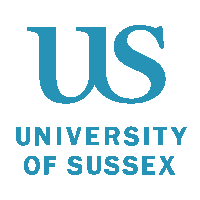

Our research primarily revolves around the principles of control and optimisation in neural processing, exploring how these concepts are manifested in both biological and artificial systems. In particular, we study variational Bayesian methods in the context of control problems. Theories such as active inference provide rich descriptions of belief-based reasoning and a principled account of adaptive behaviour under uncertainty in terms of probabilistic inference.

Central to our work is the investigation of local learning processes, seeking to bridge the gap between theoretical neuroscience and practical machine learning applications. We focus on developing computational models that encapsulate these dynamics, aiming to provide deeper insights into both the neural basis of learning and the development of more efficient artificial intelligence algorithms.

